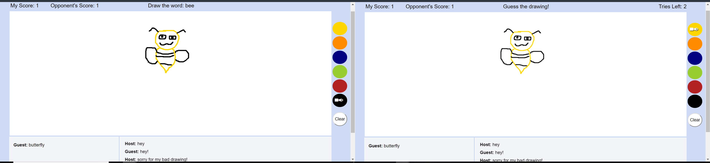

# Guess the Drawing

A drawing and guessing multiplayer game where one player draws a word and the other player guesses the word based on the drawing. Player is awarded a point for guessing the correct word. The player with the most points wins!



## Background Info

PubNub offers realtime infrastructure that enables users to connect their devices and deliver data using PubNub's global data streaming network. There are endless applications that can be done using PubNub's API, such as chat apps, ridshare apps, retail apps, multiplayer games, etc. In the case of multiplayer games, PubNub faciliates real-time interaction among players and powers the gaming functionality and social features that creates a smooth gaming exerience. For this game, PubNub was used to connect two users to a lobby where they can interact and chat in real-time. The game consists of a canvas for drawing and two chat boxes, one for writing the guessed word and the other for messaging the other player. This game was built using PubNub's [JavaScript V4 SDK](https://www.pubnub.com/docs/web-javascript/pubnub-javascript-sdk) and [ChatEngine JavaScript SDK](https://www.pubnub.com/docs/chat-engine/getting-started). If you want to build this game from scratch, check out this [blog tutorial](https://medium.com/@ocastroa/how-to-build-a-realtime-multiplayer-game-in-javascript-using-pubnub-5f410fd62f33). 

## Quick Start

1) First things first, sign up for a free PubNub [account](https://dashboard.pubnub.com/signup). Once you do so, go to your developer portal to get your Publish/Subscribe keys. You can get the keys from the Demo Project App, or you can create a new app for this project and get the keys from that app. 
    - Enable channel presence in your account [dashboard](https://admin.pubnub.com/#/user/) for the app you are using. Presence allows for detection of users in the channel. In this case, game starts when there are two player's in the channel and game ends if a player leaves before the game is over.
    - Check the box for Generate Leave on TCP FIN or RST and for Global Here Now

2) To set up ChatEngine, you will need to use different Publish/Subscribe keys from the keys used for the game. You can get your free pre-configured keys [here](https://www.pubnub.com/tutorials/chatengine/). Since the game uses two separate chat boxes (one for messaging and the other for guessing the word), you will need to reload the page(or [click here](https://www.pubnub.com/tutorials/chatengine/)) to get different keys for the ChatEngine.

3) Clone the repo.
```bash
git clone https://github.com/ocastroa/GuessWordPubNub.git
```
4) Open the files in your favorite text editor, such as [VS Code](https://code.visualstudio.com/download) or [Notepad++](https://notepad-plus-plus.org/download/v7.6.4.html) (I personally used VS Code with the Live Server Extension). 

5) Open lobby.js and replace 'game_pub_key' and 'game_sub_key' with the keys you got from Step 1. 

6) In the same file, replace 'main_chat_pub_key' and 'main_chat_sub_key' with the first set of keys you got from Step 2. Then replace 'guess_word_chat_pub_key' and 'guess_word_chat_sub_key' with the second set of keys you also got from Step 2.

7) Run index.html and enter a lobby name. Copy and paste the url to another tab, or preferably a new window, enter the same lobby name, and the game will start!

## How to Play

1) First player in the lobby is the host. Second player that joins that same lobby is the guest.

2) Game starts when there are two players in a lobby.

3) The host is given a word and needs to draw it on the canvas.

4) The guest has to guess the drawing in 3 tries and enter their guess in the guess chat box. 
    - If guest guesses the correct word, they are awarded a point.
    - The guest can see the drawing on their canvas, but cannot draw on the canvas as it is not their turn to draw. 

5) Once a word is guessed or tries equals to 0, roles are switched and the guest has to draw a new word while the host has to guess the drawing.

6) Roles keep switching until a player reaches a score of 3. That player is announced the winner and game ends.
    - If a player leaves before the game ends, the other player is announced the winner.

### Notes

- Game is kept simple, as the purpose of this game is to demonstrate how PubNub's API is implemented in a multiplayer game. The possibilities for this game are endless. You can allow for more players in a lobby, let players choose a category to draw (like animals), increase the winning score from 3, add more colors to choose from, add a time limit for drawing the word, etc.

### Acknowledgements

- Inspiration for the game, and some pieces of code, was used from PubNubs opensource project: [codoodler](https://github.com/pubnub/codoodler)- a multi-user doodling web app. 
- Other sources used: [Building Your First Multiplayer Game](https://www.pubnub.com/tutorials/javascript/multiplayer-game/), [Adding In-game Chat to a Multiplayer Game with ChatEngine](https://www.pubnub.com/blog/in-game-multiplayer-chat-with-chatengine/)
 
